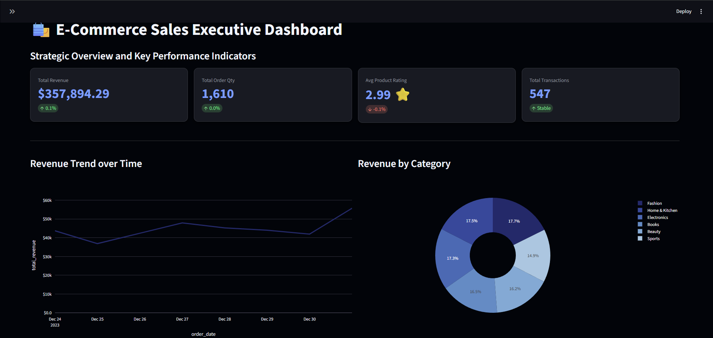
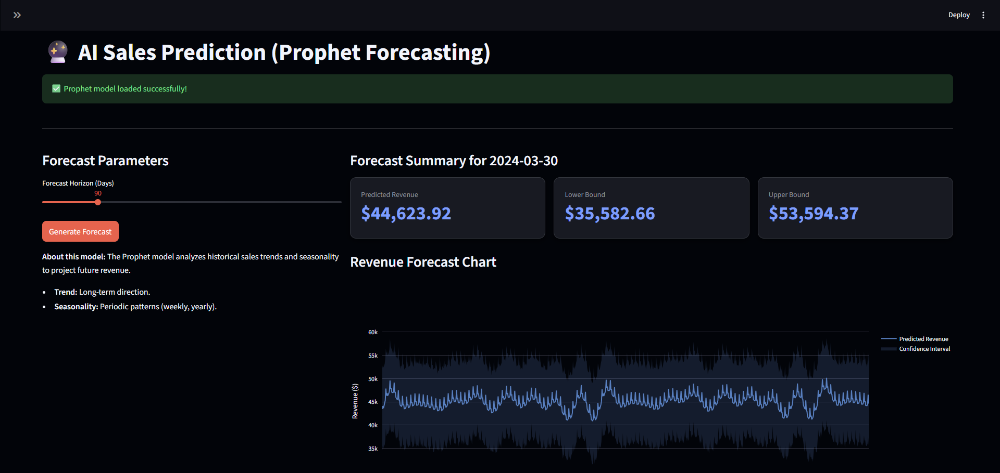
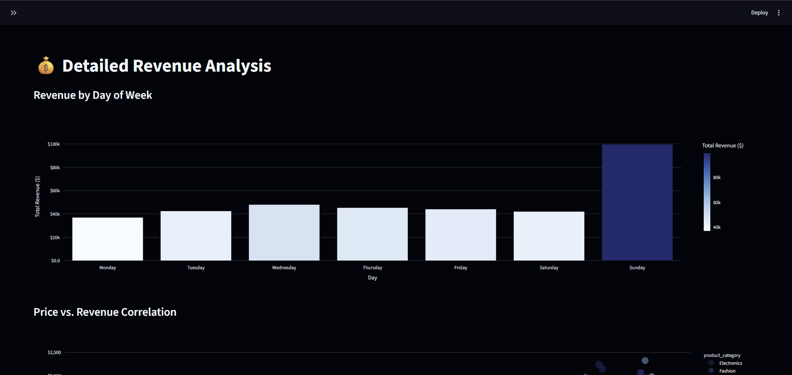

# 📊 E-Commerce Sales Analysis Dashboard

This project provides a comprehensive analysis of e-commerce sales data, featuring a dynamic Streamlit dashboard with real-time filtering, KPI tracking, and AI-powered sales forecasting using Facebook Prophet.

## 🚀 Features

- **Executive Dashboard**: High-level KPIs (Revenue, Quantity, Ratings, Transactions).
- **Revenue Analysis**: Detailed trends over time and payment method distributions.
- **Category Benchmarking**: Multi-dimensional analysis of product categories using radar charts and bubble plots.
- **AI Sales Prediction**: 90-day revenue forecasting using Prophet.
- **Interactive UI**: Premium design with custom styling and sidebar navigation.

## 📁 Project Structure

```text
ecommerce-sales-analyses/
├── data/
│   ├── raw_data/            # Original dataset
│   └── cleaned_data/        # Processed CSV for dashboard
├── models/
│   └── prophet_model.pkl    # Pre-trained Prophet model
├── src/
│   ├── data_processing.py   # Cleaning scripts
│   └── forecasting.py       # Prophet model training logic
├── notebooks/               # EDA and experimentation
├── dashboard/               # Tableau/BI files
├── reports/                 # Insights and documentation
├── main.py                  # Streamlit application entry point
├── LICENSE                  # MIT License
└── requirements.txt         # Project dependencies
```

## 🛠️ Setup & Installation

1. Create a virtual environment:
   ```bash
   python -m venv venv
   source venv/bin/activate  # On Windows: venv\Scripts\activate
   ```

2. Install dependencies:
   ```bash
   pip install -r requirements.txt
   ```

47. Run the dashboard:
   ```bash
   streamlit run main.py
   ```

## 🖼️ Dashboard & AI Forecasting Preview

Below are the snapshots captured from the live dashboard. These visuals were taken directly from the project's data analysis and model outputs.

<p align="center">
  
  <br>
  <i>Figure 1: Executive Dashboard for Sales KPIs</i>
</p>

<p align="center">
  
  <br>
  <i>Figure 2: 90-Day Revenue Forecasting with Facebook Prophet</i>
</p>

<p align="center">
  
  <br>
  <i>Figure 3: Daily Revenue Trends and Breakdown</i>
</p>

<p align="center">
  
  <br>
  <i>Figure 4: Portfolio Category Analysis</i>
</p>

> [!NOTE]
> All PNG assets included in this repository are real outputs from the data processing and analysis logic within this project.

## 👥 Project Team

- **Şafak Şenel**
- **Mihrinur İlunt**
- **Berrin Bilgin**

## 📄 License

This project is licensed under the MIT License - see the LICENSE file for details.
